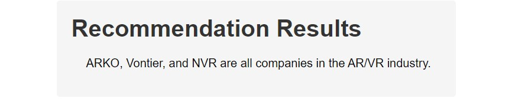
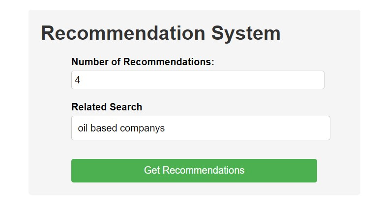

# Query-search-using-langchain

This Flask application allows users to input two text inputs such as no.of companies they would like to see for results and the type of the Industry they would like {"Technology, Oil, etc }  and receive prediction results based on the provided inputs. The application has a simple user interface where users can enter their inputs and view the prediction results on a separate page.

The project utilizes Flask, a lightweight web framework, to handle HTML templates' backend logic and rendering. The application consists of two HTML templates: `index.html` for the input form and `result.html` to display the prediction results.

This is my demo video [please start watching after 6th sec](https://drive.google.com/file/d/1H5t8ERt-BDgnq2Q_uyzWpmEIOHwig1qW/view?usp=sharing)

## Example : 

<p align='center'>
	<a href='#'></a>
</p>

This is a perfect example of the above recommendation system by lang-chain, The dataset which I have initially was `companies.csv` does not contain any data regarding the `industry _type ` or any info but I used the open-ai to create the industry_type now the question still I dont have info on the companies that have AR/VR so here I use `lang-chain` SO, it will understand the content and give the relevant companies that are using the AR/VR in the companies: Such as `ARKO` is Tech company but they use AR/VR too. So the model predict it is similar and used it 

# 2nd approach
<p align='center'>
	<a href='#'></a>
</p>

This is 2nd approach to search for a search, Where it is LLM and lang-chain it understands the user language easily  and provides the results such as : 

<p align='center'>
	<a href='#'></a>
</p>

## Installation

To run the application, follow these steps:

1. Clone the repository or download the source code.
2. Install the required dependencies using `pip`:
   ```
   pip install -r requ.txt
   ```
3. Obtain the necessary OpenAI API key to access the language model.
4. Update the Flask application code (`app.py`) with your OpenAI API key.

## Usage

1. Start the Flask application by running the following command in the terminal or command prompt:
   ```
   python app.py
   ```
2. Open a web browser and navigate to `http://localhost:5000` to access the application.
3. Enter the desired text inputs in the provided form fields.
4. Click the "Predict" button to submit the form.
5. The application will redirect you to a new page (`/result`) displaying the prediction results.

## Project Structure

The project directory structure is as follows:

```
your_app_name/
    app.py
    templates/
        index.html
        result.html
    static/
        styles.css
```

- `app.py`: Contains the Flask application code, including the route definitions and prediction logic.
- `templates/`: Directory that holds the HTML templates used by the application.
    - `index.html`: Template for the input form page.
    - `result.html`: Template to display the prediction results.
- `static/`: Directory to store static files, such as CSS stylesheets.
    - `styles.css`: CSS file that defines the styles for the HTML templates.

## Configuration

To customize the application, you can modify the HTML templates (`index.html` and `result.html`) to change the user interface or update the CSS styles in `styles.css` to adjust the visual appearance.

Additionally, you can modify the Flask application code (`app.py`) to incorporate your specific prediction logic. The current implementation uses a sample prediction list, but you should replace it with your own prediction logic based on your requirements.

Please note that this project requires an OpenAI API key to access the language model. Ensure you have a valid API key and update the `app.py` file with your key before running the application.

## License

This project is licensed under the [MIT License](LICENSE).

For more details, please refer to the [LICENSE](LICENSE) file.

## Acknowledgements

- This project utilizes the Flask framework (https://flask.palletsprojects.com/)
- The OpenAI API is used for text prediction (https://www.openai.com/)

Please refer to the documentation of Flask and OpenAI for more information on using their respective technologies.

For any further questions or assistance, feel free to reach out to the project contributors.
